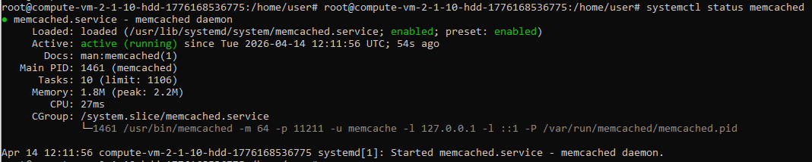
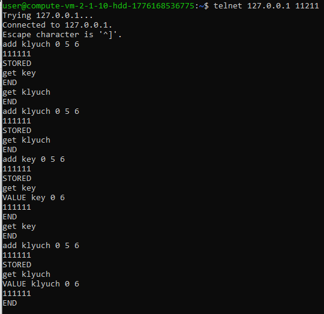
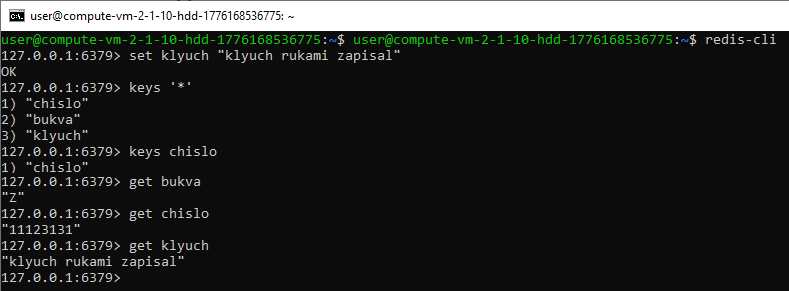

# Домашнее задание к занятию «Кеширование Redis/memcached» Сафронов П.А.


## Задание 1. Кеширование
Приведите примеры проблем, которые может решить кеширование.
Приведите ответ в свободной форме.
```
1. Быстрый доступ к часто используемым данным, как следствие снижение нагрузки на систему в целом
2. Снижение стоимости потребления ресурсов в облачной инфраструктуре
```

## Задание 2. Memcached
Установите и запустите memcached.
Приведите скриншот systemctl status memcached, где будет видно, что memcached запущен.



## Задание 3. Удаление по TTL в Memcached
Запишите в memcached несколько ключей с любыми именами и значениями, для которых выставлен TTL 5.

Приведите скриншот, на котором видно, что спустя 5 секунд ключи удалились из базы.



## Задание 4. Запись данных в Redis
Запишите в Redis несколько ключей с любыми именами и значениями.

Через redis-cli достаньте все записанные ключи и значения из базы, приведите скриншот этой операции.


